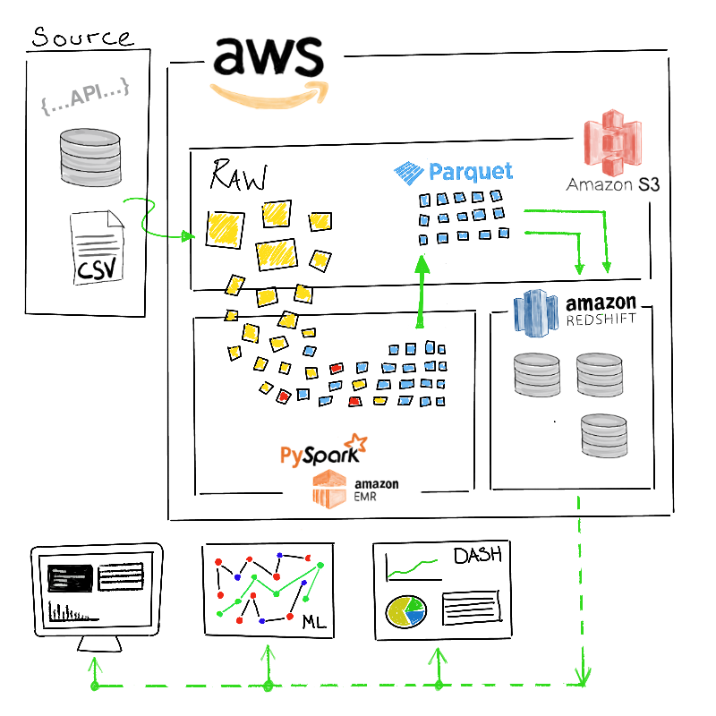
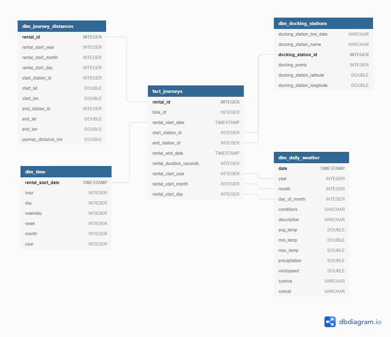
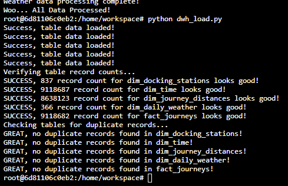
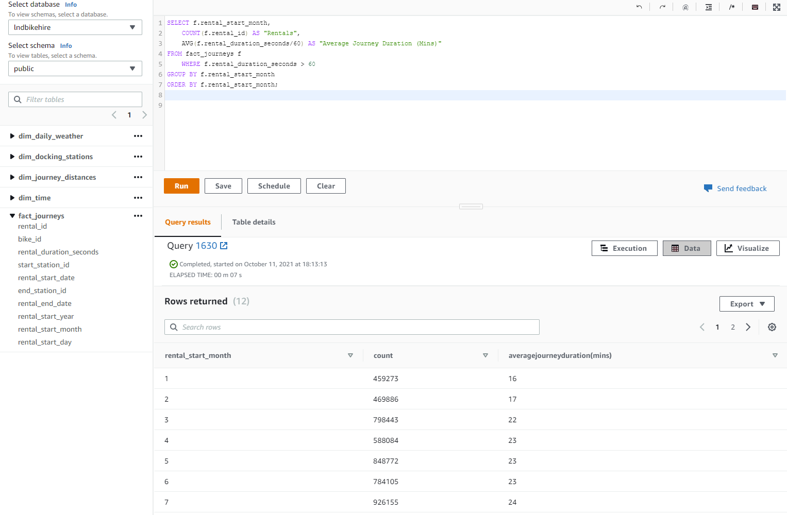
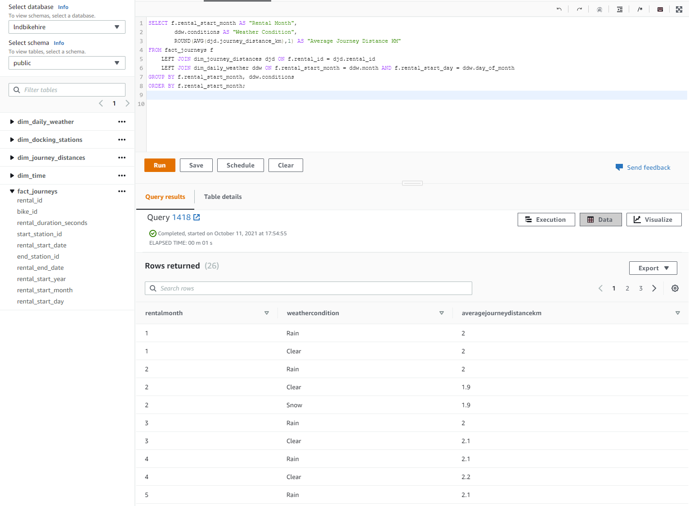

Photo by <a href="https://unsplash.com/@yomex4life?utm_source=unsplash&utm_medium=referral&utm_content=creditCopyText">Yomex Owo</a> on <a href="https://unsplash.com/collections/3542129/london-city-imges?utm_source=unsplash&utm_medium=referral&utm_content=creditCopyText">Unsplash</a>

# Capstone Project: London Public Bicycle Hire
The modelling of Santander Cycles (formerly Barclays Cycle Hire) public bicycle hire journey data, coupled with 
weather data, to gain insight into rental behaviours, and identify any correlation to weather conditions.

## Project Scope
This project is an Extract, Transform and Load (ETL) pipeline for the processing of bicycle hire journey and weather 
data for the year 2012. circa. 9M journey records 
The project scripts extract data from Amazon S3 hosted CSV and Json source data files. The data is transformed to 
S3 hosted partitioned parquet files, with the structured data subsequently loaded to a cloud data warehouse as fact and 
dimension tables for building dashboards, driving ML projects or adhoc analysis.

## Technologies and Architecture

:card_index_dividers: **Cloud Data Lake** = Amazon S3 - Simple Storage Service 
Amazon S3 is an object storage service offering scalability, data availability, security, and performance.
Customers can use it to, cost effectively, store and protect any amount of data for a range of use cases, such as data 
lakes.

:toolbox: **Data Processing** = Amazon EMR - Cluster running Apache Spark 
Amazon EMR is a managed cluster platform that simplifies running big data frameworks, such as Apache Hadoop and Apache Spark, on AWS to process and analyze vast amounts of data.
Using such frameworks and related open-source projects, you can process data for analytics purposes and business 
intelligence workloads. Amazon EMR also lets you transform and move large amounts of data into and out of other AWS 
data stores and databases, such as Amazon Simple Storage Service (Amazon S3).

:file_cabinet: **Cloud Data Warehouse** = Amazon Redshift 
Amazon Redshift is a fully managed, cloud-based, petabyte-scale data warehouse service.
Redshift has a massively parallel processing (MPP) architecture, where data is distributed across multiple compute nodes.
This Redshift to run queries against each compute node in parallel, dramatically increasing query performance.
Amazon Redshift prices are calculated based on hours of usage. Expenses can be controlled by spinning up clusters only when required.

## Repository

#### Project files and process
:white_medium_square: [ **create_tables.py** ] 
  Connects to Redshift cluster, creates database fact and dimension tables as per queries from the *sql_queries.py* 
  python file.
  
:white_medium_square: [ **sql_queries.py** ] 
  CREATE and COPY SQL statements used by create_tables.py

:white_medium_square: [ **dwh_load.py** ] 
  Executes SQL COPY queries on Amazon S3 hosted parquet files to populate data warehouse tables 
  Runs record count and duplicate record checks on data warehouse tables after data loading.

:white_medium_square: [ **etl.py** ] 
  Data processing script;
1) Loads data from S3 hosted CSV and JSON files into Spark staging dataframe.
2) Generates Fact and Dimension dataframes from staging dataframe after filtering, dropped nulls and table schemas 
   are applied. 
3) Joins dataframes to perform a completed journey distance calculation.
4) Writes fact and dimension dataframes back to AWS S3 buckets, as partitioned parquet files.

:white_medium_square: [ **dl.cfg** ] 
  Contains user AWS credentials, S3 bucket paths, cluster details, all utilised by project Python scripts.

-----
# :mechanical_arm: Running the project

## :warning: Prerequisites
- AWS Identity and access management (IAM) credentials with permissions for Amazon S3 and Redshift cluster access.
- A running Apache Spark cluster for the data processing. With your Apache Spark deployment of choice!
- A running Amazon Redshift cluster for the data warehouse.
 

:small_blue_diamond: From the repository, download/transfer 4 No. Python scripts and the config file, as detailed 
above, to a project workspace. 

:small_blue_diamond: Add AWS credentials, cluster endpoint, database and IAM role details to the config file. As per 
example below...

        [AWS]
        AWS_ACCESS_KEY_ID = SDDFHYJFG7FREWRQQAZXH3DH #TODO
        AWS_SECRET_ACCESS_KEY = Pdfgsf45srP+754SDFDSgbfuEbh #TODO
        
        [CLUSTER]
        HOST = dwhcluster.cbndkripqrtkx.us-west-2.redshift.amazonaws.com #TODO
        DB_NAME = lndbikehire #TODO
        DB_USER = lbhuser #TODO
        DB_PASSWORD = Passw0rd #TODO
        DB_PORT = 5439
        
        [IAM_ROLE]
        ARN ='arn:aws:iam::096836204836:role/dwhRole' #TODO

        [S3]
        INPUT_DATA = s3a://lnd-bikehire/source_data/
        OUTPUT_DATA = s3a://lnd-bikehire/ #TODO

:small_blue_diamond: Open a terminal window to your workspace and change directory to where the project files are 
located. 
   
        C:\users\username>cd C:\users\username\path\to\project
   
:small_blue_diamond: Run first Python script to create table schema on Redshift cluster... *create_tables.py* 

        C:\users\username>cd C:\users\username\path\to\project>python3 create_tables.py

:small_blue_diamond: Run second python script to process S3 hosted CSV & JSON files to partitioned parquet files... 
*etl.py* 

        C:\users\username>cd C:\users\username\path\to\project>python3 etl.py 

:small_blue_diamond: Run third python script to load data from parquet files to data warehouse... *dwh_load.py* 

        C:\users\username>cd C:\users\username\path\to\project>python3 dwh_load.py
---
-----
# :file_folder: Dataset
This project comprises data from 3 sources. Data used by this project is stored within an AWS S3 Data lake

### Journey data
Journey details for the year 2012. 
18 No. CSV files, amounting to approx. 9 million records for the year. 
A single bicycle rental/journey is 1 line of text within the CSV, detailing; the start & end date/time of the bicycle 
hire; the start & end docking station; the rental duration; a unique identifier for the rental; the ID of the bicycle 
used. 
Bicycle hire journey data used by this project and all other journey data, to present day, can be accessed via 
https://cycling.data.tfl.gov.uk  

Raw journey data is hosted at the following location...

    s3://lnd-bikehire/source_data/journey/

CSV sample...

    Rental Id,Duration,Bike Id,End Date,EndStation Id,EndStation Name,Start Date,StartStation Id,StartStation Name
    9340768,1238,893,04/01/2012 00:20,169,Porchester Place: Paddington,04/01/2012 00:00,224,Whiteley's: Bayswater

### Docking Station data
Details of bicycle docking stations located throughout the city. 
A single CSV file with details of 845 docking stations. 
A single docking station is 1 line of text within the CSV, detailing; the docking station name; a unique station ID; 
the No. of bicycle docking points; the station geographical coordinates. 
This data was acquired through freedom of information request to Transport for London. https://tfl.gov.uk/corporate/transparency/freedom-of-information/foi-request-detail?referenceId=FOI-0689-2122

Raw docking station data is hosted at the following location...

    s3://lnd-bikehire/source_data/infrastructure/

CSV sample...

    Go live,Docking Station,Docking station ID,Docking points,Latitude,Longitude
    Jul-10,"River Street, Clerkenwell",1,19,51.5292,-0.109971

### Weather data
City of London, historic weather data for the year 2012. 
Data from an API call was saved as a single json file with 365 days of weather observations 
Nested daily weather data detailing numerous observations; Date, temperatures, precipitation, wind speed, sunset and 
sunrise times, textual description of conditions. 
This data was acquired with an API call at https://www.visualcrossing.com/weather-api

Raw weather data is hosted at the following location...

    s3://lnd-bikehire/source_data/weather/

JSON sample...

    {
        "queryCost": 366,
        "latitude": 51.5064,
        "longitude": -0.12721,
        "resolvedAddress": "London, England, United Kingdom",
        "address": "London",
        "timezone": "Europe/London",
        "tzoffset": 0.0,
        "days": [
            {
                "datetime": "2012-01-01",
                "datetimeEpoch": 1325376000,
                "tempmax": 13.0,
                "tempmin": 7.5,
                "temp": 11.2,
                "feelslikemax": 13.0,
                "feelslikemin": 4.3,
                "feelslike": 10.4,
                "dew": 9.5,
                "humidity": 89.47,
                "precip": 9.84,
                "precipprob": null,
                "precipcover": 12.5,
                "preciptype": null,
                "snow": null,
                "snowdepth": null,
                "windgust": null,
                "windspeed": 16.4,
                "winddir": 226.0,
                "pressure": 1004.9,
                "cloudcover": 13.2,
                "visibility": 18.2,
                "solarradiation": null,
                "solarenergy": null,
                "uvindex": 0.0,
                "sunrise": "08:06:18",
                "sunriseEpoch": 1325405178,
                "sunset": "16:01:32",
                "sunsetEpoch": 1325433692,
                "moonphase": 0.26,
                "conditions": "Rain",
                "description": "Clear conditions throughout the day with rain.",
                "icon": "rain",
                "stations": [
                    "03769099999",
                    "03672099999",
                    "03781099999",
                    "03772099999",
                    "03770099999"
                ],
                "source": "obs"
            },

-----
# Cloud Data Warehouse Schema
A star schema relational database, with a single fact and multiple dimension tables. 
#### Logical Data Model

## :scroll: Data Dictionary
### Table: dim_daily_weather
Cluster distribution: All 

**Column name** | **Data type** | **Column description**
----------- | --------- | ------------------
**date**  | TIMESTAMP | NOT NULL : PRIMARY KEY : Full date of weather (yyyy-mm-dd) 
**year** | INTEGER | Year of weather forecast (yyyy)
**month** | INTEGER | Month of weather forecast (mm)
**day_of_month** | INTEGER | Day of weather forecast (dd)
**conditions** | VARCHAR | Single word descriptor of weather conditions for the day
**description** | VARCHAR | Short description of weather conditions for the day
**avg_temp** | FLOAT | Average air temperature for the day (Celsius)
**min_temp** | FLOAT | Minimum air temperature for the day (Celsius)
**max_temp** | FLOAT | Maximum air temperature for the day (Celsius)
**precipitation** | FLOAT | Rainfall for the day (mm)
**windspeed** | FLOAT | Average windspeed over a minute (mph)
**sunrise** | TIMESTAMP | Sunrise (24hr clock)
**sunset** | TIMESTAMP | Sunset (24hr clock)

### Table: dim_docking_stations
Cluster distribution: All 

**Column name** | **Data type** | **Column description**
----------- | --------- | ------------------
**docking_station_live_date**  | VARCHAR | Month-year in service date
**docking_station_name** | VARCHAR | Typically city location: Street + Area
**docking_station_id** | INTEGER | NOT NULL : PRIMARY KEY : Unique station identifier
**docking_points** | INTEGER | No. of docking points for bicycles
**docking_station_latitude** | FLOAT | Geographical coordinate specifying north-south position
**docking_station_longitude** | FLOAT | Geographical coordinate specifying east-west position

### Table: dim_time
Cluster distribution: All 

**Column name** | **Data type** | **Column description**
--------------- | ------------- | ----------------------
**rental_start_date**  | TIMESTAMP | NOT NULL : PRIMARY KEY : Full date/time of rental (yyyy-mm-dd hh-mm-ss) 
**hour** | INTEGER | NOT NULL : Hour of rental (hh)
**day** | INTEGER | NOT NULL : Day of month of rental (dd)
**weekday** | INTEGER | NOT NULL : Weekday of rental ie. Monday = 1, Tuesday = 2 .... Sunday = 7 (d)
**week** | INTEGER | NOT NULL : Week of year of rental (ww)
**month** | INTEGER | NOT NULL : Month of year of rental (mm)
**year** | INTEGER | NOT NULL : Year of rental (yyyy)

### Table: dim_journey_distances
Cluster distribution: Even 

**Column name** | **Data type** | **Column description**
--------------- | ------------- | ----------------------
**rental_id**  | INTEGER | NOT NULL : PRIMARY KEY : Unique rental identifier 
**start_station_id** | INTEGER | Rental start docking station identifier
**start_lat** | FLOAT | Rental start station geographical coordinate
**start_lon** | FLOAT | Rental start station geographical coordinate
**rental_start_year** | INTEGER | Year of rental (yyyy)
**rental_start_month** | INTEGER | Month of year of rental (mm)
**rental_start_day** | INTEGER | Day of month of rental (dd)
**end_station_id** | INTEGER | Rental end docking station identifier
**end_lat** | FLOAT | Rental end station geographical coordinate
**end_lon** | FLOAT | Rental end station geographical coordinate
**journey_distance_km** | FLOAT | Calculated kilometre distance between start and end stations (#.##)

### Table: fact_journeys
Cluster distribution: Even 

**Column name** | **Data type** | **Column description**
--------------- | ------------- | ----------------------
**rental_id**  | INTEGER | NOT NULL : PRIMARY KEY : Unique rental identifier 
**bike_id** | INTEGER | Unique bicycle identifier
**rental_duration_seconds** | INTEGER | Duration of rental in seconds
**start_station_id** | INTEGER | Rental start docking station identifier
**rental_start_date** | TIMESTAMP | Full date/time of rental (yyyy-mm-dd hh-mm-ss)
**end_station_id** | INTEGER | Rental end docking station identifier
**rental_end_date** | TIMESTAMP | Full date/time of rental (yyyy-mm-dd hh-mm-ss)
**rental_start_year** | INTEGER | Year of rental (yyyy)
**rental_start_month** | INTEGER | Month of year of rental (mm)
**rental_start_day** | INTEGER | Day of month of rental (dd)

Sample...

**rental_id** | **bike_id** | **rental_duration_seconds** | **start_station_id** | **rental_start_date** | **end_station_id** | **rental_end_date** | **rental_start_year** | **rental_start_month** | **rental_start_day**
--- | --- | --- | --- | --- | --- | --- | --- | --- | ---
10149896 | 4655	| 515 | 14 | 2012-02-22 07:45:00 | 67 | 2012-02-22 07:54:00 | 2012 | 2 | 22
 

# :thumbsup: Successful pipeline run

## :question: Queries on the data model after a successful pipeline run

### Rentals per month with average rental duration...

        SELECT f.rental_start_month,
            COUNT(f.rental_id) AS "Rentals",
            AVG(f.rental_duration_seconds/60) AS "Average Journey Duration (Mins)"
        FROM fact_journeys f
            WHERE f.rental_duration_seconds > 60
        GROUP BY f.rental_start_month
        ORDER BY f.rental_start_month;

rental_start_month | count | averagejourneyduration(mins)
--- | --- | ---
1 | 459273 | 16
2 | 469886 | 17
3 | 798443 | 22
4 | 588084 | 23
5 | 848772 | 23
6 | 784105 | 23
7 | 926155 | 24
8 | 1086579 | 23
9 | 980457 | 20
10 | 833581 | 18
11 | 706253 | 17
12 | 497582 | 19

### Average journey distance for weather condition...

        SELECT f.rental_start_month AS "Rental Month",
                ddw.conditions AS "Weather Condition",
                ROUND(AVG(djd.journey_distance_km),1) AS "Average Journey Distance KM"
        FROM fact_journeys f
            LEFT JOIN dim_journey_distances djd ON f.rental_id = djd.rental_id
            LEFT JOIN dim_daily_weather ddw ON f.rental_start_month = ddw.month AND f.rental_start_day = ddw.day_of_month
        GROUP BY f.rental_start_month, ddw.conditions
        ORDER BY f.rental_start_month;

rentalmonth | weathercondition | averagejourneydistancekm
--- | --- | ---
1 | Rain | 2
1 | Clear | 2
2 | Rain | 2
2 | Clear | 1.9
2 | Snow | 1.9
3 | Rain | 2
3 | Clear | 2.1
4 | Rain | 2.1
4 | Clear | 2.2
5 | Rain | 2.1
5 | Clear | 2.2
6 | Clear | 2.2
6 | Rain | 2.1
7 | Clear | 2.3
7 | Rain | 2.2
8 | Clear | 2.2
8 | Rain | 2.2
9 | Rain | 2.1
9 | Clear | 2.1
10 | Clear | 2.1
10 | Rain | 2
11 | Rain | 2
11 | Clear | 2
12 | Rain | 2
12 | Clear | 2
12 | Snow | 2

 

# Addressing other scenarios

Where the following scenarios may occur, the project would be adapted as follows:

:white_medium_square: The data was increased by 100x? 

Incremental data transformation and loading would be introduced, appending only new data to the data warehouse. 
The partitioning of larger tables would be introduced with indexing to allow for quicker access.
In addition, the EMR cluster hardware configuration can be scaled up to account for any increased processing 
requirements.

:white_medium_square: The pipeline would be run on a daily basis by 7am each day? 

The orchestration tool, Apache Airflow, would be introduced to schedule the ETL pipeline run at the required schedule.
Airflow uses directed acyclic graphs (DAGs) to manage workflow orchestration. DAGs can be run either on a defined 
schedule (e.g. hourly or daily) or based on external event triggers.

:white_medium_square: The database needed to be accessed by 100+ people? 

To achieve the best possible query performance, data needs to be distributed across the compute nodes in a way that 
is optimal to the workloads being run on the cluster. The optimal way to distribute data for tables that are 
commonly joined is to store rows with matching join keys on the same nodes. This enables Amazon Redshift to join the 
rows locally on each node without having to move data around the nodes. 
Redshift has the ability to scale quickly, letting the user adjust the extent depending on their peak workload 
times. To increase the storage or the need for faster performance, more nodes can be added using AWS console or Cluster 
API, resulting in immediate upscaling.
